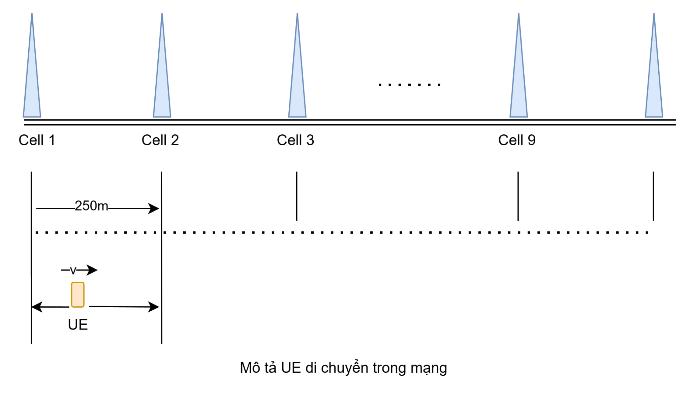

# SimRAN
## Bài toán:
* Thiết kế môi trường mô phỏng mạng vô tuyến động, trong đó một thiết bị người dùng (UE) di chuyển liên tục qua vùng phủ sóng của nhiều trạm gốc (Cells). Mục tiêu của Agent là học được chiến lược tối ưu để đồng thời giải quyết hai nhiệm vụ: Ra quyết định chuyển giao (Handover Decision) và Cấp phát tài nguyên (Resource Allocation). Thuật toán cần cân bằng giữa việc đảm bảo duy trì kết nối liên tục (QoS), tối ưu hóa hiệu suất sử dụng tài nguyên mạng và giảm thiểu các tác động tiêu cực như hiệu ứng "Ping-pong".

## Mô tả UE di chuyển trong mạng

## Clone dự án từ GitHub
```
git clone https://github.com/eouinht/SimRAN-.git
cd SimRAN-
```

## Tạo môi trường ảo

```
python3 -m venv .venv
```

## Kích hoạt môi trường ảo
```
source .venv/bin/activate
```
## Cài đặt các gói cần thiết
```
pip install -r requirements.txt
```

## Train
```
python train_dqn.py 
```